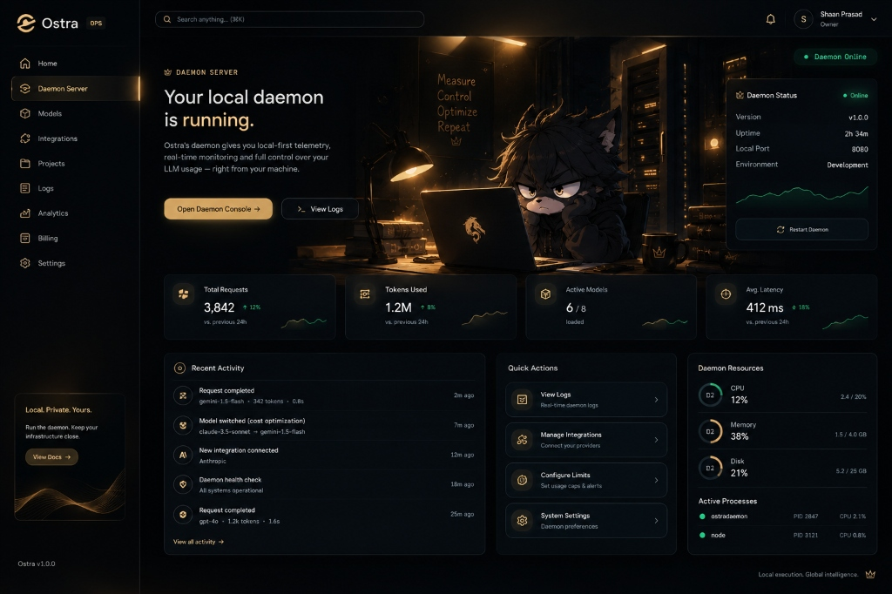
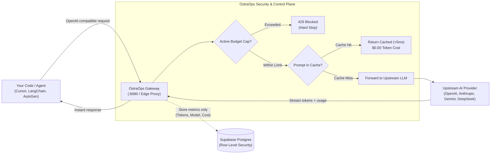

<p align="center">
  
</p>

<h1 align="center">OstraOps</h1>

<p align="center">
  <b>Real-Time AI Spend Tracking, Intelligent Gateway & Budget Guardrails</b><br>
  Stop runaway agent loops, eliminate surprise cloud bills, and enforce sub-millisecond limits — with <b>Zero Prompt Retention</b>.
</p>

<p align="center">
  
  
  
  
  
</p>

<p align="center">
  
</p>

---

### ⚡ Built for developers who refuse to get blindsided by AI API bills
[OstraOps](https://github.com/stoppingarc01-ai/Ostra-FinOps) is your **intelligent AI gateway and real-time observability control plane**. Whether you're running autonomous coding agents in Cursor, executing batch pipelines with LangChain, or serving production LLM endpoints, OstraOps keeps your costs under control before your credit card is charged.

---

## 💡 What is OstraOps? (In Simple Words)

Building with frontier models like **GPT-4o, Claude 3.7 Sonnet, Gemini 2.5, or DeepSeek R1** is fast and powerful, but costs can explode without warning:
- An autonomous agent gets trapped in an unexpected recursive loop.
- A background worker re-prompts 500k context tokens 50 times in a row.
- Official cloud billing dashboards lag behind by **2 to 8 hours**.

**OstraOps solves this by acting as your live circuit breaker:**
It sits between your code and the AI providers, measuring every input and output token the millisecond it streams. If your spending hits your predefined cap (e.g. $10/day), OstraOps safely pauses further calls with an immediate `429 Budget Exceeded` response — saving your balance from drain.

---

## 🛡️ Core Principles & How We Work



### 1. Pre-Execution Budget Checks (Kill-Switch)
Most FinOps tools only warn you after money is already spent. OstraOps intercepts calls *before* forwarding to upstream providers. If you are over budget, the request is halted instantly.

### 2. Zero Prompt Retention (Total Privacy)
We believe your proprietary code, customer chats, and business data must remain 100% private:
- **No Prompt Logging:** We inspect only token usage headers, model IDs, and HTTP metadata.
- **No Chat Storage:** Prompt text and completion messages are streamed directly to your client and never saved to any database or disk.
- **No Model Training:** Your intellectual property is never used for training or fine-tuning.

### 3. Sub-Millisecond Smart Caching
Identical or repetitive requests (e.g. unit tests, fixed prompt templates) are served directly from an ultra-low latency in-memory cache, saving both response latency and 100% of the token cost for that request.

### 4. Fail-Open Reliability
If the monitoring layer ever experiences a transient hiccup, your production traffic is never blocked — the gateway fails open to preserve 99.99% application uptime.

---

## 🔐 Authentication & Access Control

OstraOps uses production-grade identity management:

- **User & Team Authentication:** Powered by **Supabase Auth** with cryptographic JWTs (JSON Web Tokens), bcrypt/Argon2 password hashing, secure session cookies, and refresh token rotation.
- **Gateway API Keys:** Applications and agent scripts connect using high-entropy OstraOps API keys (`ostra_live_...`). Keys are hashed using SHA-256 before storage in Postgres, preventing credential leaks even in internal audits.

---

## 🗄️ Data Storage Architecture

All platform configuration and metric telemetry are securely backed by **Supabase PostgreSQL**:

| Data Stored | Saved? | Details |
| :--- | :---: | :--- |
| **User & Team Accounts** | ✅ Yes | Email, team name, and assigned role (Admin/Member). |
| **Token & Spend Aggregates** | ✅ Yes | Input/output token counts, model identifier, calculated cost, timestamp. |
| **Budget Caps & Alert Rules** | ✅ Yes | Daily/monthly caps, webhook endpoints (Slack, Discord, Email). |
| **Prompts & Completions** | ❌ **NEVER** | Discarded immediately after streaming. Never saved to database or disk. |
| **Embeddings & Files** | ❌ **NEVER** | Never stored or cached permanently. |

### Multi-Tenant Isolation (Row Level Security)
Every database table enforces **PostgreSQL Row Level Security (RLS)**. The database engine guarantees that Workspace A can never read, modify, or access Workspace B's data under any condition.

---

## 💳 Transparent Pricing

Flexible plans built to grow with developers, startups, and production AI teams:

| Plan | Price | Ideal For | Key Capabilities |
| :--- | :---: | :--- | :--- |
| **Community CLI** | **$0** / forever | Terminal users & solo hackers | • Open-source CLI (`npx ostraops`)<br>• Local terminal spend calculations<br>• Multi-model pricing cheatsheet |
| **Agent Telemetry** | **$20** / month<br>*(or $16/mo billed annually)* | Developers wanting observability only | • Zero proxy interception required<br>• Real-time token velocity & health monitoring<br>• Model cost & latency benchmarking<br>• Webhook alerts (Slack, Discord, Email)<br>• Up to 3 active agent trackers |
| **Starter Gateway** | **$35** / month<br>*(or $28/mo billed annually)* | Production apps & startup teams | • Full **OstraOps Gateway** proxy<br>• Automated hard budget caps & kill-switch<br>• In-memory smart caching (up to 1,000 queries)<br>• Multi-provider routing (OpenAI, Anthropic, Gemini, DeepSeek)<br>• Up to 5 concurrent agent connections |
| **Pro Gateway** | **$59** / month<br>*(or $47/mo billed annually)* | Heavy autonomous agents & scaling teams | • **Everything in Starter** +<br>• **Unlimited** concurrent agents & workflows<br>• Semantic & persistent caching<br>• Multi-model automated failover & load balancing<br>• Team role permissions & audit logs<br>• Priority Discord/Slack engineering support |

### 👥 Extra Developer Seats
Need your whole engineering team on the dashboard?
- **$5 per developer seat / month**
- Grants team members individual logins, personal spend analytics, and scoped API keys without sharing master credentials.

---

## 🚀 Developer Integration

Connecting your application or AI agents to OstraOps takes under 60 seconds:

### 1. Instant Terminal Tracking (Community CLI)
```bash
npx ostraops
```

### 2. Route Through OstraOps Gateway
Simply point your existing OpenAI, LangChain, or Cursor configuration to your OstraOps gateway endpoint:

```typescript
import OpenAI from 'openai';

const openai = new OpenAI({
  apiKey: process.env.OPENAI_API_KEY,
  baseURL: 'https://gateway.ostraops.com/v1', // Or your assigned team gateway endpoint
  defaultHeaders: {
    'x-ostraops-key': process.env.OSTRAOPS_API_KEY, // Scoped team or agent token
  },
});

// Requests are automatically budget-checked and token-counted in real time
const response = await openai.chat.completions.create({
  model: 'gpt-4o',
  messages: [{ role: 'user', content: 'Analyze runtime telemetry' }],
});
```

---

## 🤝 Contributing (For Open-Source Contributors)

We welcome community contributions, model rate card updates, and SDK adapters! Here is how you can contribute:

### 🎯 What You Can Contribute
- **Model Rate Cards:** Add new models, pricing updates, or context capacity updates in `models/`.
- **SDK Integrations:** Help write adapters or snippets for LangChain, LlamaIndex, AutoGen, CrewAI, and Vercel AI SDK.
- **Documentation:** Improve developer tutorials, API references, or translations.
- **Bug Fixes:** Fix UI rendering bugs, edge-case token calculation drifts, or gateway proxy headers.

### 🛠️ Contributor Workflow

1. **Fork the Repository:**  
   Click the **Fork** button at the top right of this repository.

2. **Clone your fork locally:**
   ```bash
   git clone https://github.com/<your-username>/Ostra-FinOps.git
   cd Ostra-FinOps
   ```

3. **Create a Feature Branch:**
   ```bash
   git checkout -b fix/model-rate-card-deepseek-r1
   ```

4. **Install Dependencies & Test:**
   ```bash
   npm install
   npm run build # Ensure TypeScript and bundle pass cleanly
   ```

5. **Commit with Conventional Messages:**
   ```bash
   git commit -m "fix(models): update DeepSeek R1 output token pricing"
   ```

6. **Submit a Pull Request (PR):**
   - Push your branch to your GitHub fork: `git push origin <your-branch-name>`
   - Open a PR against `stoppingarc01-ai/Ostra-FinOps:main`.

> [!NOTE]  
> **Notice for Commercial & Production Use:**  
> The core schemas, CLI, and integration adapters are open for community enhancement under MIT. The hosted multi-tenant management backend, enterprise telemetry cluster, and managed billing infrastructure are proprietary services of OstraOps. Self-hosting production enterprise features without an authorized enterprise license is strictly prohibited.

---

## 🌐 Supported Model Families

OstraOps maintains real-time rate cards for 40+ leading foundation models:

| Provider | Supported Models |
| :--- | :--- |
| **OpenAI** | GPT-4o, GPT-4o mini, o1, o3-mini, GPT-4 Turbo |
| **Anthropic** | Claude 3.7 Sonnet, Claude 3.5 Sonnet, Claude 3.5 Haiku, Claude 3 Opus |
| **Google** | Gemini 2.5 Pro, Gemini 2.5 Flash, Gemini 1.5 Pro, Flash Lite |
| **DeepSeek** | DeepSeek R1, DeepSeek V3 |
| **Meta** | Llama 3.3 70B, Llama 3.1 405B, Llama 3.1 8B |
| **Mistral** | Mistral Large 2, Codestral 2501, Mistral Small 3 |
| **xAI** | Grok 2, Grok 2 Vision |

---

## 📄 License

This project is licensed under the [MIT License](LICENSE) — free, transparent, and built for developers building the next generation of AI applications.
