# OstraOps ⚡

<p align="center">
  
  
  
  
  
  
</p>

<p align="center">
  <b>Real-Time AI Spend Tracking, Intelligent Reverse Gateway & Hard Budget Guardrails</b><br>
  Stop runaway agent loops, prevent surprise cloud bills, and enforce sub-millisecond limits — with <b>Zero Prompt Retention</b>.
</p>

---

## 📖 Table of Contents
- [Overview & Problem Statement](#-overview--problem-statement)
- [Feature Implementation Status Matrix](#-feature-implementation-status-matrix)
- [Deep Technical Architecture: Concurrency & Budget Kill-Switch](#-deep-technical-architecture-concurrency--budget-kill-switch)
  - [The Concurrency Problem (Race Conditions)](#the-concurrency-problem-race-conditions)
  - [The 2-Phase Reservation & Reconciliation Protocol](#the-2-phase-reservation--reconciliation-protocol)
  - [Fail-Open vs. Fail-Closed Policy](#fail-open-vs-fail-closed-policy)
- [Auditable Privacy & Zero Prompt Retention](#-auditable-privacy--zero-prompt-retention)
  - [What is Stored vs. What is Never Stored](#what-is-stored-vs-what-is-never-stored)
  - [Key Hashing & Cryptographic Storage](#key-hashing--cryptographic-storage)
- [Quickstart & Verification (Clean Environment)](#-quickstart--verification-clean-environment)
  - [Prerequisites & Installation](#prerequisites--installation)
  - [Running the Local Dashboard](#running-the-local-dashboard)
  - [Verifying Live API Telemetry & Gateway](#verifying-live-api-telemetry--gateway)
- [Supported Model Families & Rate Cards](#-supported-model-families--rate-cards)
- [Authentication & Row Level Security (RLS)](#-authentication--row-level-security-rls)
- [Subscription Plans & Entitlements](#-subscription-plans--entitlements)
- [Contributing Guidelines](#-contributing-guidelines)
- [License](#-license)

---

## 💡 Overview & Problem Statement

When building with frontier models like **GPT-4o, Claude 3.7 Sonnet, Gemini 2.5, Kimi k1.5, or DeepSeek R1**, API costs can explode without warning:
- An autonomous coding agent gets trapped in a recursive error or loop condition.
- A batch pipeline re-prompts 500k context tokens 50 times in a row.
- Official provider billing dashboards lag behind by **2 to 8 hours**, notifying you only after budget limits are breached.

**OstraOps is your real-time circuit breaker and observability gateway.**  
It operates as a high-speed reverse gateway proxy between your client application and upstream AI providers. It parses token usage the millisecond it streams, calculates exact financial dollar costs from built-in rate cards, and cuts off further calls with `429 Budget Exceeded` before surprise charges hit your credit card.

---

## 📊 Feature Implementation Status Matrix

To provide complete transparency between active code, work-in-progress, and future roadmap items:

| Capability / Feature | Status | Implementation Details |
| :--- | :---: | :--- |
| **Real-Time Token & Cost Calculation** | 🟢 **Live** | Client and gateway rate-card calculation across 45+ models in `src/components/IntegrationsView.tsx` and `test-api.mjs`. |
| **Interactive FinOps Dashboard** | 🟢 **Live** | Real-time spend charts, model breakdowns, cost share, and usage logs (`src/components/OverviewView.tsx`). |
| **Zero Prompt Retention Guarantee** | 🟢 **Live** | Strict metadata extraction pipeline; prompt bodies and completion texts are discarded immediately after streaming. |
| **Multi-Tenant Postgres Schema & RLS** | 🟢 **Live** | Full PostgreSQL schema with Row-Level Security policies in `supabase/schema.sql`. |
| **Live API Terminal Verification Script** | 🟢 **Live** | Runnable live tester `test-api.mjs` verifying keys, latencies, tokens, and syncing to `/live-telemetry.json`. |
| **Pre-Flight Budget Kill-Switch (`429`)** | 🟡 **Beta** | Budget rule engine (`src/lib/budgetsService.ts`) with hard/soft thresholds and kill-switch actions. |
| **Concurrent Budget Lease Reservation** | 🟡 **Beta** | 2-phase pessimistic reservation protocol with token estimation and post-stream delta settlement (detailed below). |
| **Configurable Fail-Open / Fail-Closed** | 🟡 **Beta** | Explicit gateway flag: choose between 99.99% application uptime or absolute zero-overspend enforcement. |
| **In-Memory & Edge Smart Caching** | 🟡 **Beta** | Exact-match query caching for deterministic prompts and repetitive test runs. |
| **Semantic & Distributed Vector Caching** | 🔵 **Roadmap** | Multi-region Redis cluster with embedding similarity search for fuzzy prompt deduplication. |

---

## ⚡ Deep Technical Architecture: Concurrency & Budget Kill-Switch

### The Concurrency Problem (Race Conditions)

A naive budget enforcement system checks `current_spend < budget_limit` when a request arrives, forwards the request, and updates the database after the response finishes. 

Under concurrent traffic, this creates a critical vulnerability:
- Suppose a workspace has **$1.00** remaining in its daily budget.
- 50 concurrent requests arrive within 50 milliseconds.
- Each request checks the budget: all 50 see `$1.00 remaining` and pass validation.
- Each request costs `$0.20`.
- **Result:** $10.00 is spent on a $1.00 budget — an **overshoot of 900%**.

### The 2-Phase Reservation & Reconciliation Protocol

To prevent budget overshoots under concurrent load, OstraOps employs a **2-Phase Lease Reservation Protocol**:

```mermaid
sequenceDiagram
    autonumber
    actor Client as Agent / Client App
    participant Gateway as OstraOps Gateway Proxy
    participant Store as Budget & Ledger Store
    participant Upstream as AI Provider (OpenAI/Anthropic/Gemini/Kimi)

    Client->>Gateway: POST /v1/chat/completions (model, messages, max_tokens)
    
    rect rgb(20, 25, 35)
    Note over Gateway,Store: Phase 1: Atomic Lease Reservation
    Gateway->>Store: Atomic Check & Reserve Estimated Cost
    alt Budget Exhausted
        Store-->>Gateway: Reservation Denied (Current + Reserved >= Limit)
        Gateway-->>Client: HTTP 429 Too Many Requests {"error": "Budget Exceeded"}
    else Budget Available
        Store-->>Gateway: Lease Granted (Reservation ID, Reserved Amount)
    end
    end

    rect rgb(15, 30, 25)
    Note over Gateway,Upstream: Phase 2: Upstream Execution & Stream
    Gateway->>Upstream: Forward Request to Provider
    Upstream-->>Gateway: Stream Response Chunks & Usage Tokens
    Gateway-->>Client: Stream Response Chunks in Real Time
    end

    rect rgb(20, 25, 35)
    Note over Gateway,Store: Phase 3: Reconciliation & Settlement
    Gateway->>Store: Settle Lease (Actual Cost = tokens * rate)
    Store->>Store: Finalize Spend & Release Reserved Delta
    end
```



1. **Pre-Flight Estimation & Atomic Reservation:**
   - Before forwarding to the upstream provider, the gateway estimates the maximum cost:
     $$\text{Estimated Cost} = (\text{Input Tokens} \times \text{Input Rate}) + (\min(\text{max\_tokens}, \text{Default Cap}) \times \text{Output Rate})$$
   - It performs an atomic `DECRBY` or conditional reservation on the workspace's available balance.
   - If the remaining balance is insufficient, the request is immediately rejected with `429 Too Many Requests: Budget Exceeded` without invoking the upstream API.

2. **Upstream Streaming & Token Capture:**
   - The prompt is forwarded to the upstream provider (OpenAI, Anthropic, Google, Kimi, etc.).
   - The gateway streams completion chunks to the client with sub-millisecond overhead.
   - On the final chunk or completion response, the exact `usage` metadata (`prompt_tokens`, `completion_tokens`) is captured.

3. **Reconciliation & Delta Settlement:**
   - Exact cost is calculated from the model's official rate card:
     $$\text{Actual Cost} = (\text{Actual Input Tokens} \times \text{Input Rate}) + (\text{Actual Output Tokens} \times \text{Output Rate})$$
   - The temporary reservation is converted into finalized spend, and any unused reserved credit is immediately released back to the available pool.

4. **Error Handling & Cancelled Requests:**
   - If the upstream provider returns an error (HTTP 5xx, 401, 429), or if the client disconnects before generation begins, the reservation is automatically refunded in full.

### Fail-Open vs. Fail-Closed Policy

A central question in financial engineering is how the gateway behaves when the telemetry database or accounting service is unavailable or times out:

| Mode | Behavior during Accounting Outage | Risk Profile | Recommended Use Case |
| :--- | :--- | :--- | :--- |
| **`FAIL_OPEN`** *(Default)* | Requests continue to upstream providers without budget verification. | Small risk of spending beyond budget cap during outage. | Production user-facing apps where 99.99% availability is prioritized over strict financial limits. |
| **`FAIL_CLOSED`** | Requests are rejected with `503 Service Unavailable: Accounting Unreachable`. | Zero risk of overspend; calls are blocked if ledger is offline. | Autonomous scraping agents, background batch runners, or testing pipelines with fixed credit ceilings. |

This behavior is explicitly configurable per workspace or per API key using the `x-ostraops-fail-mode: open | closed` header or via the dashboard security settings.

---

## 🔒 Auditable Privacy & Zero Prompt Retention

OstraOps is designed from first principles for strict enterprise data privacy and regulatory compliance (GDPR, SOC2, HIPAA-adjacent environments).

### What is Stored vs. What is Never Stored

| Data Point | Retained in Database? | Storage Purpose & Mechanics |
| :--- | :---: | :--- |
| **Model ID & Provider Name** | ✅ Yes | Required for rate calculation, analytics, and quota enforcement. |
| **Token Counts (Input & Output)** | ✅ Yes | Extracted from HTTP response headers or provider `usage` payloads. |
| **Calculated Dollar Spend ($USD)** | ✅ Yes | Computed in real time from rate cards; stored for billing reports. |
| **Latency & HTTP Status Code** | ✅ Yes | Used for uptime telemetry, health metrics, and alert triggers. |
| **Timestamp & Request ID** | ✅ Yes | Correlation key for audit logs and ledger reconciliation. |
| **Prompt Text & Message Payloads** | ❌ **NEVER** | Discarded immediately after streaming. No disk writes, no logging. |
| **Model Completion Output** | ❌ **NEVER** | Streamed directly through socket to client; never buffered to database. |
| **System Instructions & Embeddings** | ❌ **NEVER** | Never stored, inspected, or cached permanently. |
| **Training Use** | ❌ **NEVER** | Zero data is ever stored, reused, or shared for machine learning training. |

### Key Hashing & Cryptographic Storage

1. **Virtual Gateway Keys (`ostra_live_...`):**
   - Virtual API keys issued to agents are hashed using **SHA-256** before being saved to PostgreSQL (`supabase/schema.sql`).
   - Plaintext keys are shown only once upon creation. Even with direct read access to the database, keys cannot be reversed.
2. **Upstream Provider Vault Keys:**
   - Upstream API keys stored in the Hardware Security Vault (`src/components/SecurityConsoleView.tsx`) are encrypted at rest using **AES-256-GCM** with envelope encryption.

---

## 🚀 Quickstart & Verification (Clean Environment)

Verify that OstraOps runs cleanly on your machine in under 2 minutes:

### Prerequisites & Installation

- **Node.js**: `v18.0.0` or higher
- **npm**: `v9.0.0` or higher

```bash
# 1. Clone the repository
git clone https://github.com/stoppingarc01-ai/Ostra-FinOps.git
cd Ostra-FinOps

# 2. Install dependencies
npm install

# 3. Verify TypeScript build
npm run build
```

### Running the Local Dashboard

```bash
# Start the local development server
npm run dev
```

Navigate to `http://localhost:5173` to explore the live telemetry dashboard, model catalog, and budget management console.

### Verifying Live API Telemetry & Gateway

The repository includes a standalone live testing script (`test-api.mjs`) that connects to upstream AI APIs, measures latency, calculates token usage, and streams real-time telemetry to `/public/live-telemetry.json` for the overview dashboard:

```bash
# Run with your Gemini or AI provider key
node test-api.mjs <YOUR_API_KEY> [optional-model-name]

# Example output:
# ⚡ OstraOps Live Terminal API Tester
# --------------------------------------------------
# ✔ Key Loaded: AIza••••xxxx
# → Sending prompt: "Namaste! Confirm in 1 sentence that you are live..."
# ✔ SUCCESS (HTTP 200 OK)
# Latency: 245ms
# Tokens: 42 total (14 in, 28 out)
# ✔ Telemetry logged to public/live-telemetry.json (Dashboard synced)
```

Open the dashboard Overview tab to see the live request appear instantly on your spend velocity chart.

---

## 🌐 Supported Model Families & Rate Cards

OstraOps maintains real-time rate cards and latency benchmarks across 45+ foundation models:

| Provider | Supported Models | Context Window | Input / Output Rate (per 1M tokens) |
| :--- | :--- | :---: | :---: |
| **Kimi (Moonshot AI)** | Kimi k1.5, Moonshot v1 128K, Moonshot v1 32K, Moonshot v1 8K, Kimi Latest | Up to 128k | $0.17 – $1.00 / $0.17 – $3.00 |
| **OpenAI** | GPT-5.6, GPT-5.6-mini, GPT-5.6-nano, GPT-5.5, GPT-5.4, GPT-4o, o3-mini | Up to 512k | $0.15 – $4.50 / $0.60 – $18.00 |
| **Anthropic** | Claude 3.7 Sonnet, Claude 3.5 Sonnet, Claude 3.5 Haiku, Claude Opus 4.8 | Up to 1,000k | $0.40 – $8.00 / $1.60 – $32.00 |
| **Google** | Gemini 3.8 Flash, Gemini 3.7 Flash, Gemini 3.1 Pro, Gemini 2.5 Pro | Up to 4,194k | $0.03 – $1.50 / $0.12 – $6.00 |
| **DeepSeek** | DeepSeek V4, DeepSeek V3, DeepSeek R1 | Up to 128k | $0.14 – $0.55 / $0.28 – $2.19 |
| **Mistral** | Mistral Medium 3.5, Mistral Small 4, Mistral Large 3, Ministral 3 14B | Up to 128k | $0.06 – $2.00 / $0.18 – $6.00 |
| **xAI** | Grok 4.1, Grok 4, Grok 4 Fast, Grok 3 Mini | Up to 256k | $0.25 – $2.50 / $1.00 – $10.00 |
| **Qwen** | Qwen3-Max, Qwen3-Coder, Qwen3-235B | Up to 128k | $0.30 – $1.60 / $1.20 – $6.40 |
| **Meta** | Llama 4 Maverick, Llama 4 Scout, Llama 3.3 70B | Up to 256k | $0.20 – $0.65 / $0.40 – $1.30 |
| **Cohere** | Command A, Command R+ | Up to 256k | $0.90 – $2.50 / $2.70 – $10.00 |

Full rate cards and filterable context limits are accessible in `src/components/IntegrationsView.tsx` and the interactive Model Catalog in the dashboard.

---

## 🔐 Authentication & Row Level Security (RLS)

OstraOps supports production-grade multi-tenant access control backed by **PostgreSQL Row Level Security (RLS)** in `supabase/schema.sql`:

1. **User Authentication:**
   - Supabase Auth with cryptographic JWT tokens.
   - HttpOnly cookie handling and automatic refresh token rotation.
2. **Workspace Isolation:**
   - Every database query strictly resolves against the active `auth.uid()` and verified `organization_id`.
   - Even if an API request is tampered with, the PostgreSQL engine guarantees that Tenant A cannot inspect, aggregate, or manipulate Tenant B's data under any condition.

---

## 💳 Subscription Plans & Entitlements

| Tier | Price | Ideal For | Key Capabilities |
| :--- | :---: | :--- | :--- |
| **Community CLI** | **$0** / forever | Solo hackers & terminal users | • Open-source CLI & local telemetry<br>• Terminal spend calculations (`test-api.mjs`)<br>• Full multi-model pricing directory |
| **Agent Telemetry** | **$20** / month | Observability without proxy | • Live token velocity tracking<br>• Model cost & latency benchmarking<br>• Webhook alerts (Slack, Discord, Email)<br>• Up to 3 active agent trackers |
| **Starter Gateway** | **$35** / month | Production apps & startup teams | • Hosted **OstraOps Gateway** edge proxy<br>• Hard budget caps & pre-flight kill-switch (`429`)<br>• In-memory smart caching<br>• Multi-provider routing (OpenAI, Anthropic, Gemini, Kimi, DeepSeek)<br>• Up to 5 concurrent agent connections |
| **Pro Gateway** | **$59** / month | Heavy autonomous agents & scale | • **Everything in Starter** +<br>• **Unlimited** concurrent agents & workflows<br>• 2-phase atomic budget reservations<br>• Configurable fail-open / fail-closed policies<br>• Team role permissions & audit logs |

---

## 🤝 Contributing Guidelines

We welcome community contributions, model rate card updates, and client SDK adapters!

### What to Contribute
- **Model Rate Cards:** Add new model releases, pricing adjustments, or context window updates in `src/components/IntegrationsView.tsx`.
- **SDK Integrations:** Client adapters for LangChain, LlamaIndex, AutoGen, CrewAI, and the Vercel AI SDK.
- **Bug Fixes & Tests:** Add unit tests, edge-case token handling, and gateway proxy optimizations.

### Contributor Workflow
1. Fork the repository on GitHub.
2. Clone your fork locally: `git clone https://github.com/<your-username>/Ostra-FinOps.git`
3. Create a feature branch: `git checkout -b fix/rate-card-update`
4. Verify tests and build: `npm run build`
5. Commit using conventional commit format: `git commit -m "fix(rates): update Kimi k1.5 output pricing"`
6. Submit a Pull Request against `main` with detailed verification notes.

---

## 📄 License

This project is licensed under the [MIT License](LICENSE) — free, transparent, and built for developers creating the next generation of AI software.
